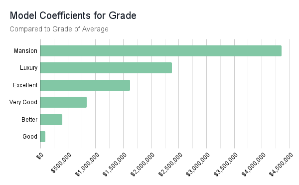

# King County Housing Analysis Project 

 

## Overview 

This project takes a given data set consisting of houses sold in King County, Washington, and uses it to create a linear regression model to predict house sale prices based on applicable variables.  The project goes through data exploration, pre-processing, model iteration, and final reviews the results of the final model chosen. 

## The Business + Project Goals 

A non-profit addiction treatment center is looking to expand their services to offer half-way houses or sober living homes.  These types of living spaces are hugely beneficial to those in recovery.  It provides a safe space for transitioning back into the "real world" after going through in-patient rehab.  The center is interested in knowing how much different types of homes would cost in order to set budgetary and fundraising goals.   

The project aims to give the treatment center the best possible prediction of what different types of homes would cost based on the square footage of the living area of the home, the number of bathrooms, the evaluated grade of the home, and a few other applicable variables.  

## Creating Linear Regression Models 

- Data exploration 
- Simple Linear Regression 
- Pre-processing the categorical variables 
- Linear Regression Model 
- Model with Log Transformed Target Variable 
- Model with Ouliers in Target Variable dropped 

## Final Regression Results 

- r-sqaured 
- model + ___ coefficients statistially significant 
- MAE  

## Conclusion 
### Suggestions 

- Budget a minimum of $900,000 - $920,000 -- average price of a 2100 square foot home with two and half bath, and a grade rating of average 
- For homes with a larger square footage, budget an additional $300 per square foot 
> Best fit visual here ? 

- For homes with a grade rating better than average, additional money will need to be set aside to purhcase these properties.  

 

### Next Steps 

Many times, when companies or individuals try to create half-way homes or sober living homes in residential areas, there can be harmful push back from the communities.  It would be wise to investigate how the zone affects the sale price of homes and plan accordingly -- either by adjusting amount of money put towards a home in or out of a residential zone, or by getting out in the community prior to opening a home in a residential area to help easy community fears and biases to those in recovery.    

This next step would be best implemented after potential purchases have been narrowed down to specific cities or towns in King County, due to the complexity behind zoning ordinances.  Zones are defined by the cities and towns themselves rather than by the county, and do not follow any easily accessible boundaries, such as zip codes lines (as we can see from the images below).  

 
 
